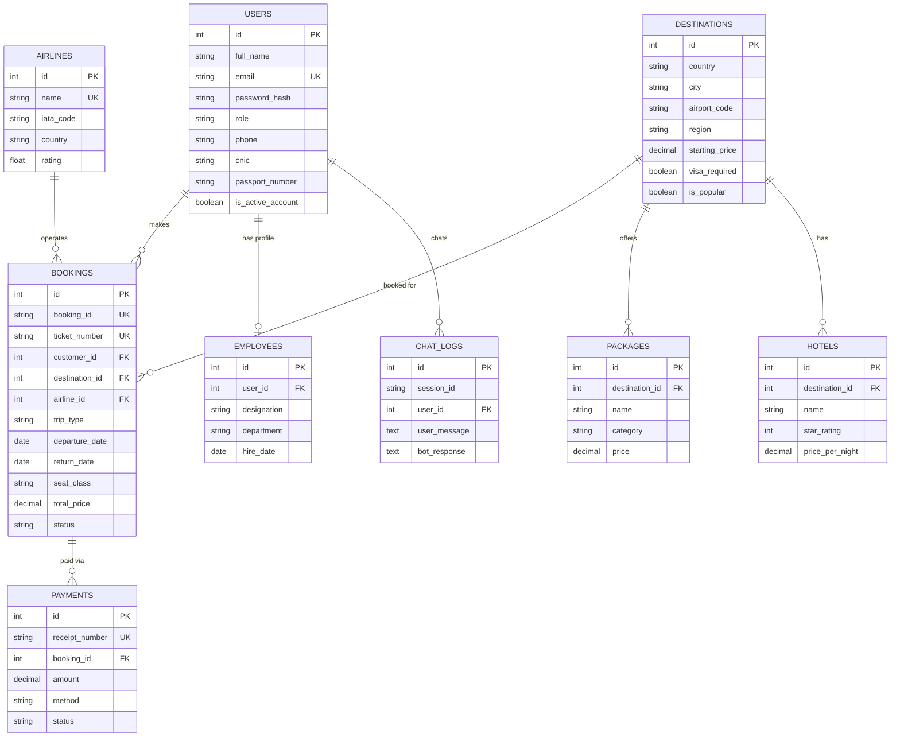

# Entity-Relationship Diagram (Description)

Since this is a text-based deliverable, the ER diagram is described below in a copy-pasteable [Mermaid](https://mermaid.js.org/) format. Paste the block into any Mermaid live editor (e.g. mermaid.live) to render it visually, or view it directly in tools that support Mermaid (GitHub, many Markdown viewers).

## Cardinality Summary
- One **User** (customer) can have many **Bookings** (1:M).
- One **User** (employee) has exactly one **Employee** profile (1:1).
- One **Destination** can appear in many **Bookings**, **Packages**, and **Hotels** (1:M each).
- One **Airline** can operate many **Bookings** (1:M).
- One **Booking** can have multiple **Payment** attempts, e.g. a failed card payment followed by a successful bank transfer (1:M).
- One **User** can generate many **ChatLog** entries; guests (unauthenticated) produce ChatLog rows with `user_id = NULL`.
